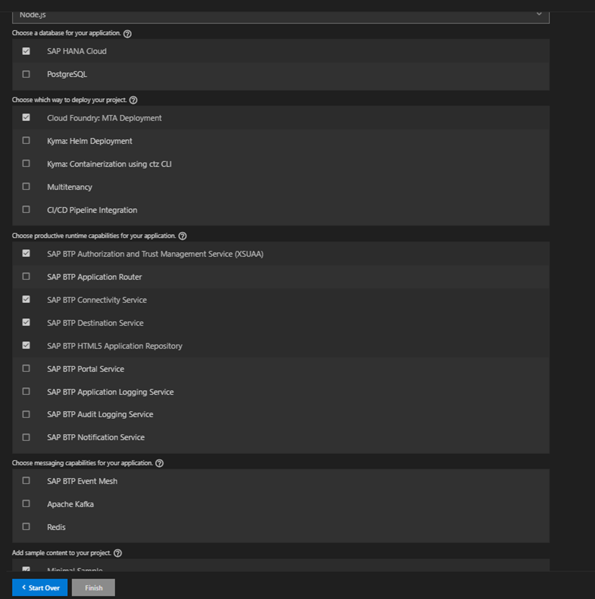

# Getting Started

Welcome to your new project.
with basic needed options selected for a CAP application 

adding the UI module seperately 

It contains these folders and files, following our recommended project layout:

File or Folder | Purpose
---------|----------
`app/` | content for UI frontends goes here
`db/` | your domain models and data go here
`srv/` | your service models and code go here
`package.json` | project metadata and configuration
`readme.md` | this getting started guide

## Next Steps

- Open a new terminal and run `cds watch`
- (in VS Code simply choose _**Terminal** > Run Task > cds watch_)
- Start adding content, for example, a [db/schema.cds](db/schema.cds).

## Learn More

Learn more at https://cap.cloud.sap/docs/get-started/.
